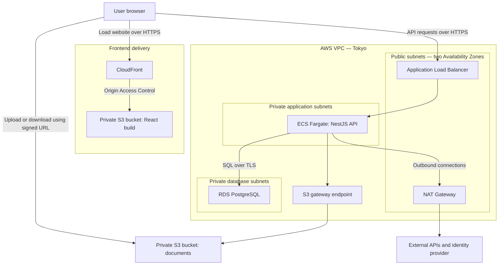
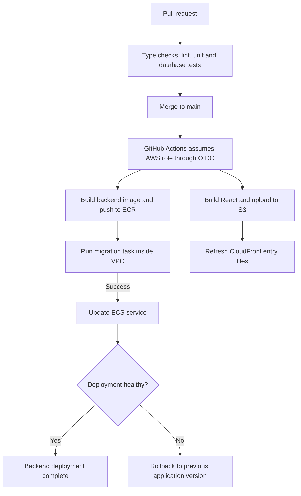

# AWS Cloud Infrastructure Plan — University Library Portal

Status: proposed first live deployment; infrastructure has not yet been provisioned.

This plan translates `deployment-blueprint.md` into a concrete AWS deployment: a single NestJS application on ECS Fargate, backed by RDS PostgreSQL, with React served through CloudFront and S3. It preserves the original architecture while clarifying networking, permissions, scheduled jobs, and deployment behaviour.

## 1. Application infrastructure

CloudFront delivers the React application. The React code then runs in the browser, which calls the API directly through the load balancer.

The backend accesses RDS through private VPC networking. **RDS traffic does not pass through NAT**; that label in the original blueprint needs correcting. NAT provides outbound access for private application tasks. The diagram highlights application traffic; supporting AWS service access is described below. [AWS networking documentation](https://docs.aws.amazon.com/AmazonECS/latest/developerguide/networking-outbound.html)

## 2. AWS service responsibilities

| AWS component | Responsibility | Initial configuration |
|---|---|---|
| Route 53 | Resolves frontend and API domain names | One hosted zone |
| ACM | HTTPS certificates | CloudFront certificate plus regional ALB certificate |
| CloudFront | Delivers the React application | One distribution |
| S3 frontend bucket | Stores Vite’s compiled HTML, JavaScript, CSS, and images | Private; CloudFront access only |
| Application Load Balancer | Terminates API HTTPS and forwards requests | HTTPS listener; HTTP redirects to HTTPS |
| ECS Fargate | Runs NestJS and its domain modules | One service, initially one running task |
| ECR | Stores backend Docker images | Images identified by commit SHA |
| RDS PostgreSQL | Stores catalogue, members, workflows, audit records, and search data | Single-AZ initially; automated backups |
| S3 document bucket | Stores owned thesis/report files | Private; encryption and versioning enabled |
| Secrets Manager | Stores database credentials and genuine application secrets | Inject selected secrets into tasks |
| SES | Sends reservation, overdue, and publication emails | Verified sender; sandbox acceptable initially |
| CloudWatch | Collects logs, metrics, and alarms | Defined retention and basic operational alarms |
| IAM | Controls access between AWS components | Separate deployment, execution, and application roles |

Keep the frontend bucket private using **CloudFront Origin Access Control**, with a regular S3 origin rather than an S3 website endpoint. Configure SPA route handling so refreshing `/resources/123` loads the React application. [AWS CloudFront documentation](https://docs.aws.amazon.com/AmazonCloudFront/latest/DeveloperGuide/private-content-restricting-access-to-s3.html)

## 3. Region, domains, and networking

Use **Tokyo (`ap-northeast-1`)** as the proposed application region, assuming initial users and demonstrations are primarily in Japan.

### Domain mapping

| Address | Destination |
|---|---|
| `library.example.com` | CloudFront → frontend S3 bucket |
| `api.library.example.com` | ALB → NestJS |
| Document access | Temporary S3 URLs issued after authorization |

These domains are placeholders. CloudFront’s ACM certificate must be in **`us-east-1`**. The ALB certificate belongs in the ALB’s region—Tokyo in this plan. [AWS certificate requirements](https://docs.aws.amazon.com/AmazonCloudFront/latest/DeveloperGuide/cnames-and-https-requirements.html)

### Subnet placement

Use one VPC with subnet groups across two Availability Zones.

| Subnet group | Contents | Internet routing |
|---|---|---|
| Public | ALB and NAT Gateway | Internet Gateway |
| Private application | Fargate API and migration tasks | Outbound through NAT |
| Private database | RDS | No direct internet route |

For the initial deployment, one NAT Gateway is a cost compromise. It makes outbound connectivity dependent on that gateway’s Availability Zone. A more resilient deployment uses one per AZ. [AWS networking guidance](https://docs.aws.amazon.com/AmazonECS/latest/developerguide/networking-outbound.html)

The S3 gateway endpoint handles backend S3 traffic. Other public AWS service endpoints can initially be reached through NAT; interface VPC endpoints can be evaluated later.

### Security groups

| Destination | Allow inbound from |
|---|---|
| ALB, port 443 | Internet |
| ALB, port 80 | Internet, for HTTPS redirect only |
| NestJS, port 3000 | ALB security group only |
| PostgreSQL, port 5432 | API and migration-task security groups only |

An RDS subnet group spanning two AZs does **not** mean the database itself is Multi-AZ. The initial database can remain Single-AZ. [AWS RDS networking documentation](https://docs.aws.amazon.com/AmazonRDS/latest/UserGuide/USER_VPC.WorkingWithRDSInstanceinaVPC.html)

## 4. Feature-to-infrastructure mapping

| Feature | Runtime path |
|---|---|
| Catalogue search | Browser → ALB → NestJS → PostgreSQL full-text search |
| Reservation | NestJS transaction updates reservation/copy records in RDS |
| Thesis metadata submission | NestJS saves the draft in RDS |
| Thesis upload | NestJS authorizes upload → browser uploads directly to private S3 |
| Thesis publication | NestJS transaction publishes catalogue data and writes audit records |
| Thesis download | NestJS checks publication, embargo, and permissions → returns signed S3 URL |
| Journal access | NestJS checks license → simulated resolver returns the access destination |
| Notifications | NestJS notification handler → SES |
| Overdue/expiry checks | Scheduled NestJS job → RDS transaction → notification event |

For uploads, include a **completion step**: after the browser uploads, the backend verifies that the expected object exists and meets the upload requirements before accepting it as the submission’s file.

Keep public frontend assets and restricted documents in separate buckets. Their access policies and lifecycle rules differ. Store document object keys in the owning workflow/content records; the final placement should follow the reconciled thesis submission model.

## 5. Background jobs and identity

### Background jobs

Initially, retain the blueprint’s in-process NestJS schedulers:

- Overdue checks.
- Reservation pickup expiry.
- Embargo expiry or related notifications, depending on the final embargo model.

Each job needs locking and repeat-safe updates. Even with a desired task count of one, deployments can temporarily run old and new tasks together. Jobs should also catch up on overdue work after restarts.

Later, move jobs into **EventBridge Scheduler → one-off Fargate tasks**, retaining the same domain services.

### Identity

Keep the **SSO-consuming architecture**. Infrastructure does not resolve the missing real identity provider: the hosted demonstration needs an explicitly isolated demo identity arrangement, while a real institutional deployment needs the university’s login integration.

Keep the development token issuer disabled in production. Define the hosted demo login arrangement before exposing protected workflows.

## 6. AWS permissions and secrets

Use three distinct IAM roles.

| Role | Responsibility |
|---|---|
| GitHub deployment role | Push images, deploy frontend assets, launch migrations, update ECS |
| ECS task execution role | Pull ECR images, deliver logs, inject referenced secrets |
| Application task role | Access permitted document objects and send email through SES |

Use the application task role for S3 and SES access rather than storing long-lived AWS access keys in Secrets Manager. ECS supplies temporary role credentials to the application. [AWS task-role documentation](https://docs.aws.amazon.com/AmazonECS/latest/developerguide/task-iam-roles.html)

Database passwords belong in Secrets Manager. Public JWT verification keys fetched from JWKS are public configuration, not secrets. Scope each role to its required resources and operations.

## 7. Deployment pipeline

### Backend deployment

1. Run type checks, lint, unit tests, and integration tests against real PostgreSQL.
2. Build the backend image and push it to ECR, identified by commit SHA.
3. Launch a one-off migration task inside the VPC using the release image.
4. Run `prisma migrate deploy` and wait for successful task completion.
5. Update the ECS service only if migration succeeds.
6. Check deployment health and roll back the application if the deployment fails.

GitHub Actions launches the migration task **inside the VPC**, where it can reach private RDS. The hosted GitHub runner does not need direct database access.

Serialize deployments so two releases cannot run migrations simultaneously. Use backward-compatible migrations; running migrations first does not make destructive schema changes safe. Application rollback does not undo database migrations.

For v1, use **rolling deployments with the ECS deployment circuit breaker and rollback enabled**. Health checks alone do not configure automatic rollback. [AWS deployment circuit breaker](https://docs.aws.amazon.com/AmazonECS/latest/developerguide/deployment-circuit-breaker.html)

### Frontend deployment

Build the React application, upload the generated assets to the frontend S3 bucket, and refresh the relevant CloudFront entry files. Frontend and backend releases must remain API-compatible if deployed independently.

## 8. Monitoring and initial deployment scope

Configure the ECS `awslogs` driver explicitly; logs are not automatically delivered merely because the application runs on Fargate. [AWS logging documentation](https://docs.aws.amazon.com/AmazonECS/latest/developerguide/using_awslogs.html)

Start with alarms for:

- Unhealthy API targets.
- Elevated API errors.
- Database storage and connection pressure.
- Failed or missing scheduled jobs.

Emit scheduler heartbeat metrics. CloudWatch does not directly inspect the application’s audit table. Define log retention and test database recovery before relying on the deployment for persistent data.

| Deploy initially | Add when justified |
|---|---|
| One Fargate API task | Multiple tasks and autoscaling |
| Single-AZ RDS with backups | Multi-AZ RDS |
| Direct Prisma → RDS connections | RDS Proxy |
| PostgreSQL search | OpenSearch |
| In-process jobs with locking | Separate scheduled tasks |
| Logged notification failures | Durable notification queue and retries |
| Rolling deployment with rollback | Blue/green deployment |

## 9. Relationship to the existing blueprint

This plan keeps the original service choices and makes the first deployment boundary explicit. The following clarifications should carry into implementation:

- RDS connections use private VPC networking, not NAT.
- Frontend assets and academic documents occupy separate private S3 buckets.
- IAM task roles provide application access to AWS services.
- GitHub Actions launches database migrations inside the VPC.
- Rolling deployment rollback must be configured explicitly.
- Scheduled jobs need locking and repeat-safe behaviour regardless of deployment strategy.
- CloudWatch log delivery and scheduler metrics require configuration.
- RDS Proxy, Multi-AZ database deployment, and blue/green deployment are deferred enhancements.

The resulting first deployment is **CloudFront/S3 for React, ALB/Fargate for NestJS, private RDS for application data, and private S3 for owned academic documents**.
