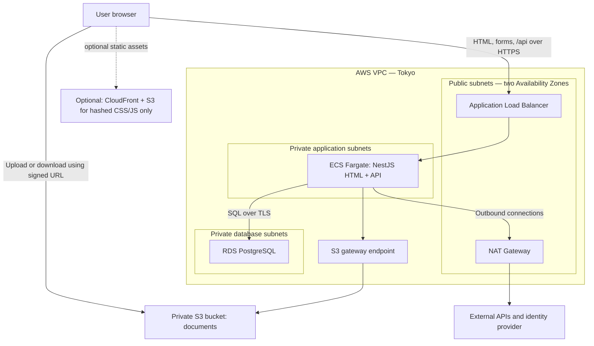
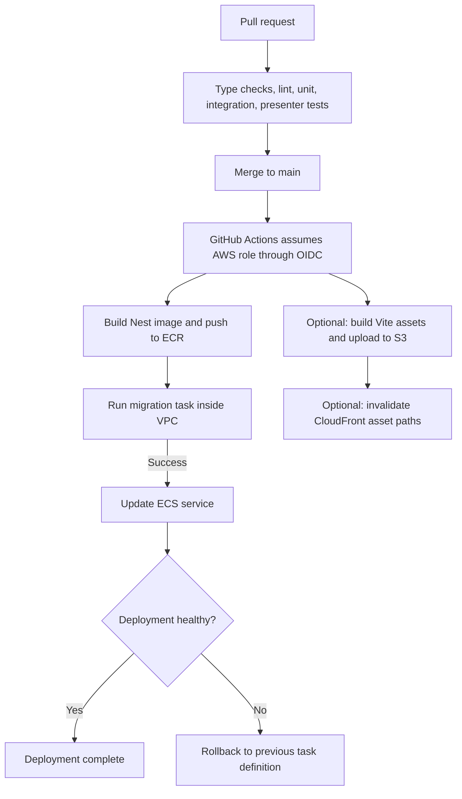

# AWS Cloud Infrastructure Plan — University Library Portal

Status: proposed first live deployment; infrastructure has not yet been provisioned.

This plan translates `deployment-blueprint.md` into a concrete AWS deployment: a single NestJS application on ECS Fargate (**HTML portal + JSON API**), backed by RDS PostgreSQL, with private S3 for owned academic documents. Hashed CSS/JS from the Vite **asset** pipeline may optionally use CloudFront. There is **no separate React SPA origin**.

## 1. Application infrastructure

NestJS serves Handlebars HTML and `/api` through the load balancer. Optional CloudFront is for CDN’d assets only — page routes remain Nest’s responsibility so search URLs and form posts stay first-class.

The application accesses RDS through private VPC networking. **RDS traffic does not pass through NAT**. NAT provides outbound access for private application tasks. [AWS networking documentation](https://docs.aws.amazon.com/AmazonECS/latest/developerguide/networking-outbound.html)

## 2. AWS service responsibilities

| AWS component | Responsibility | Initial configuration |
|---|---|---|
| Route 53 | Resolves the portal hostname (and optional `api.` host) | One hosted zone |
| ACM | HTTPS certificates | Regional ALB certificate (CloudFront cert only if CDN is used) |
| Application Load Balancer | Terminates HTTPS; forwards to Nest | HTTPS listener; HTTP redirects to HTTPS |
| ECS Fargate | Runs NestJS (MVC views + domain API) | One service, initially one running task |
| ECR | Stores Docker images | Images identified by commit SHA |
| RDS PostgreSQL | Catalogue, members, workflows, audit, search | Single-AZ initially; automated backups |
| S3 document bucket | Owned thesis/report files | Private; encryption and versioning enabled |
| CloudFront + S3 assets *(optional)* | Hashed CSS/JS from Vite asset build | Not an HTML/SPA origin |
| Secrets Manager | DB credentials and app secrets (session/CSRF material) | Inject into tasks |
| SES | Reservation, overdue, publication emails | Verified sender; sandbox OK initially |
| CloudWatch | Logs, metrics, alarms | Retention + basic operational alarms |
| IAM | Access between AWS components | Separate deployment, execution, application roles |

Do **not** configure SPA fallback routing on S3 — HTML routes are Nest handlers.

## 3. Region, domains, and networking

Use **Tokyo (`ap-northeast-1`)** as the proposed application region, assuming initial users and demonstrations are primarily in Japan.

### Domain mapping

| Address | Destination |
|---|---|
| `library.example.com` | ALB → NestJS (HTML + `/api` + optional local static) |
| `api.library.example.com` *(optional)* | ALB → NestJS JSON API only |
| Document access | Temporary S3 URLs issued after authorization |
| `assets.library.example.com` *(optional)* | CloudFront → hashed CSS/JS bucket |

These domains are placeholders. If CloudFront is used for assets, its ACM certificate must be in **`us-east-1`**. The ALB certificate belongs in Tokyo. [AWS certificate requirements](https://docs.aws.amazon.com/AmazonCloudFront/latest/DeveloperGuide/cnames-and-https-requirements.html)

### Subnet placement

Use one VPC with subnet groups across two Availability Zones.

| Subnet group | Contents | Internet routing |
|---|---|---|
| Public | ALB and NAT Gateway | Internet Gateway |
| Private application | Fargate Nest tasks and migration tasks | Outbound through NAT |
| Private database | RDS | No direct internet route |

For the initial deployment, one NAT Gateway is a cost compromise. A more resilient deployment uses one per AZ. [AWS networking guidance](https://docs.aws.amazon.com/AmazonECS/latest/developerguide/networking-outbound.html)

The S3 gateway endpoint handles backend S3 traffic. Other public AWS service endpoints can initially be reached through NAT; interface VPC endpoints can be evaluated later.

### Security groups

| Destination | Allow inbound from |
|---|---|
| ALB, port 443 | Internet |
| ALB, port 80 | Internet, for HTTPS redirect only |
| NestJS, port 3000 | ALB security group only |
| PostgreSQL, port 5432 | Nest and migration-task security groups only |

An RDS subnet group spanning two AZs does **not** mean the database itself is Multi-AZ. The initial database can remain Single-AZ. [AWS RDS networking documentation](https://docs.aws.amazon.com/AmazonRDS/latest/UserGuide/USER_VPC.WorkingWithRDSInstanceinaVPC.html)

## 4. Feature-to-infrastructure mapping

| Feature | Runtime path |
|---|---|
| Catalogue search | Browser → ALB → NestJS (HTML or HTMX partial) → PostgreSQL FTS |
| Reservation / renew | HTML form or HTMX → NestJS service → RDS conditional update |
| Thesis metadata submission | NestJS saves the draft in RDS |
| Thesis upload | NestJS authorizes → browser uploads directly to private S3 (vanilla TS module) |
| Thesis publication | NestJS transaction publishes catalogue data and writes audit records |
| Thesis download | NestJS checks publication, embargo, permissions → signed S3 URL |
| Journal access | NestJS checks license → simulated resolver returns the access destination |
| Notifications | NestJS notification handler → SES |
| Overdue/expiry checks | Scheduled NestJS job → RDS transaction → notification event |

For uploads, include a **completion step**: after the browser uploads, the backend verifies that the expected object exists and meets the upload requirements before accepting it as the submission’s file.

Keep **optional public assets** and **restricted documents** in separate buckets. Store document object keys in the owning workflow/content records.

## 5. Background jobs and identity

### Background jobs

Initially, retain the blueprint’s in-process NestJS schedulers:

- Overdue checks.
- Reservation pickup expiry.
- Embargo expiry or related notifications, depending on the final embargo model.

Each job needs locking and repeat-safe updates. Even with a desired task count of one, deployments can temporarily run old and new tasks together. Jobs should also catch up on overdue work after restarts.

Later, move jobs into **EventBridge Scheduler → one-off Fargate tasks**, retaining the same domain services.

### Identity

Keep the **SSO-consuming architecture**. The portal prefers **same-origin HttpOnly Secure cookies** (plus CSRF on state-changing forms); the JSON API may continue to accept Bearer tokens for machine clients. The `PublicKeyProvider` seam (mock static key ↔ IdP JWKS) still validates identity.

Keep the development token issuer disabled in production. Define the hosted demo login arrangement before exposing protected workflows.

## 6. AWS permissions and secrets

Use three distinct IAM roles.

| Role | Responsibility |
|---|---|
| GitHub deployment role | Push images, optional asset upload, launch migrations, update ECS |
| ECS task execution role | Pull ECR images, deliver logs, inject referenced secrets |
| Application task role | Access permitted document objects and send email through SES |

Use the application task role for S3 and SES access rather than storing long-lived AWS access keys in Secrets Manager. [AWS task-role documentation](https://docs.aws.amazon.com/AmazonECS/latest/developerguide/task-iam-roles.html)

Database passwords and session/CSRF secrets belong in Secrets Manager. Public JWT verification keys fetched from JWKS are public configuration, not secrets.

## 7. Deployment pipeline

### Application deployment

1. Run type checks, lint, unit tests, and integration tests against real PostgreSQL (including view-model exhaustiveness once Phase 6 exists).
2. Build the Nest image and push it to ECR, identified by commit SHA.
3. Launch a one-off migration task inside the VPC using the release image.
4. Run `prisma migrate deploy` and wait for successful task completion.
5. Update the ECS service only if migration succeeds.
6. Check deployment health and roll back the application if the deployment fails.

GitHub Actions launches the migration task **inside the VPC**, where it can reach private RDS.

Serialize deployments so two releases cannot run migrations simultaneously. Application rollback does not undo database migrations.

For v1, use **rolling deployments with the ECS deployment circuit breaker and rollback enabled**. [AWS deployment circuit breaker](https://docs.aws.amazon.com/AmazonECS/latest/developerguide/deployment-circuit-breaker.html)

### Asset deployment *(optional)*

If CSS/JS are CDN-hosted: build the Vite asset bundle, upload hashed files to the assets bucket, invalidate CloudFront paths. HTML always comes from the Nest release — assets and Nest versions must stay compatible within a release train.

## 8. Monitoring and initial deployment scope

Configure the ECS `awslogs` driver explicitly. [AWS logging documentation](https://docs.aws.amazon.com/AmazonECS/latest/developerguide/using_awslogs.html)

Start with alarms for:

- Unhealthy Nest targets.
- Elevated 5xx / error rates.
- Database storage and connection pressure.
- Failed or missing scheduled jobs.

Emit scheduler heartbeat metrics. Define log retention and test database recovery before relying on the deployment for persistent data.

| Deploy initially | Add when justified |
|---|---|
| One Fargate Nest task | Multiple tasks and autoscaling |
| Single-AZ RDS with backups | Multi-AZ RDS |
| Direct Prisma → RDS connections | RDS Proxy |
| PostgreSQL search | OpenSearch |
| In-process jobs with locking | Separate scheduled tasks |
| Logged notification failures | Durable notification queue and retries |
| Rolling deployment with rollback | Blue/green deployment |
| Nest-served static assets | CloudFront for hashed CSS/JS |

## 9. Relationship to the existing blueprint

This plan keeps the original service choices and updates the delivery model to match the Handlebars/HTMX UI decision:

- RDS connections use private VPC networking, not NAT.
- Academic documents occupy a private S3 bucket; optional asset CDN is separate and is not an SPA.
- IAM task roles provide application access to AWS services.
- GitHub Actions launches database migrations inside the VPC.
- Rolling deployment rollback must be configured explicitly.
- Scheduled jobs need locking and repeat-safe behaviour regardless of deployment strategy.
- CloudWatch log delivery and scheduler metrics require configuration.
- RDS Proxy, Multi-AZ database deployment, and blue/green deployment are deferred enhancements.

The resulting first deployment is **ALB/Fargate for NestJS (HTML + API), private RDS for application data, and private S3 for owned academic documents** — with optional CloudFront only for hashed static assets.
